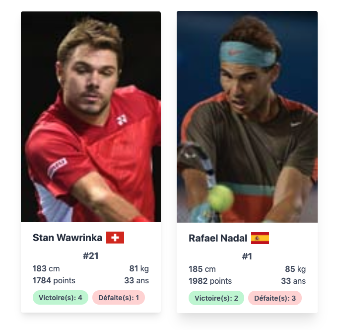

# Introduction

Demo site: [Link](https://vibrant-hoover-7cf69c.netlify.com/)

Tech stack: [React](https://reactjs.org/) + [TypeScript](https://www.typescriptlang.org/) + [Tailwind](https://tailwindcss.com/) + [PostCSS](https://postcss.org/)

The project was created using [create-react-app](https://github.com/facebook/create-react-app/).

# Quick start

`yarn`

`yarn start`

## Available commands

- **start**: runs the app in development mode on http://localhost:3000.
- **start:tw**: build tailwind css file for development (all css class outputted)
- **start:tw-watch**: build tailwind css file for development (all css class outputted) in watch mode
- **build**: build the app for production under `build` folder
- **build:tw**: build tailwind css file for production using `purge css` (only used css class are outputted)
- **test**: launch test runner (Jest) in interactive watch mode
- **eject**: one way operation to copy configuration files and transitive dependencies into the project. (more information on this on [create-react-app](https://github.com/facebook/create-react-app/blob/master/packages/react-scripts/template/README.md) documentation)
